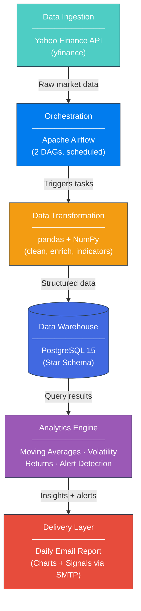
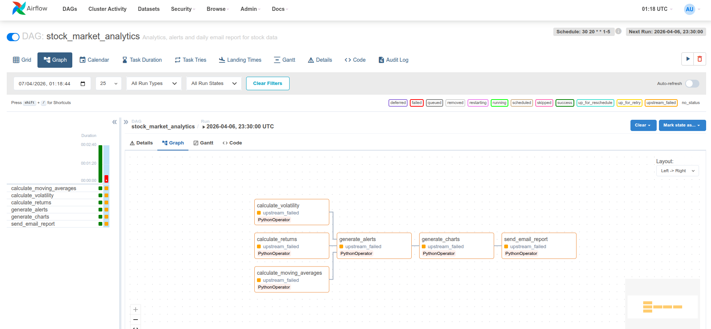
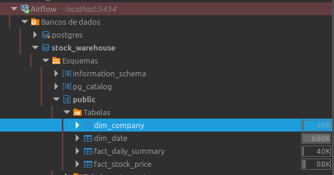
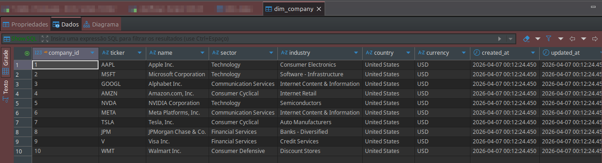
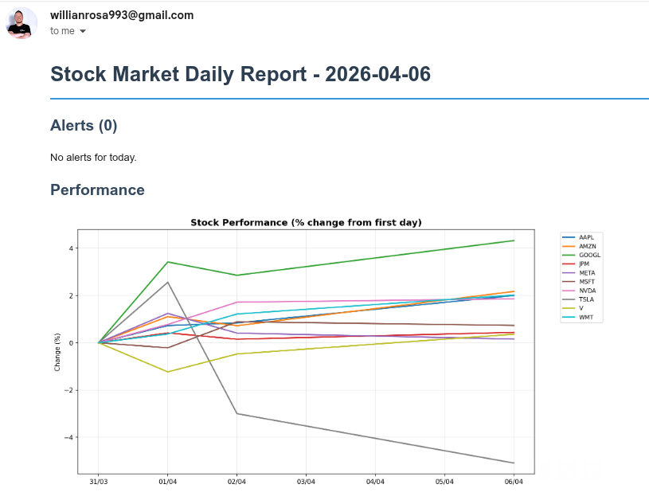
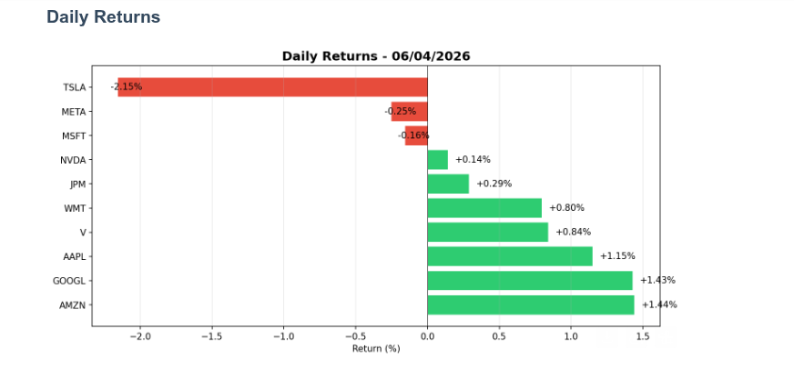
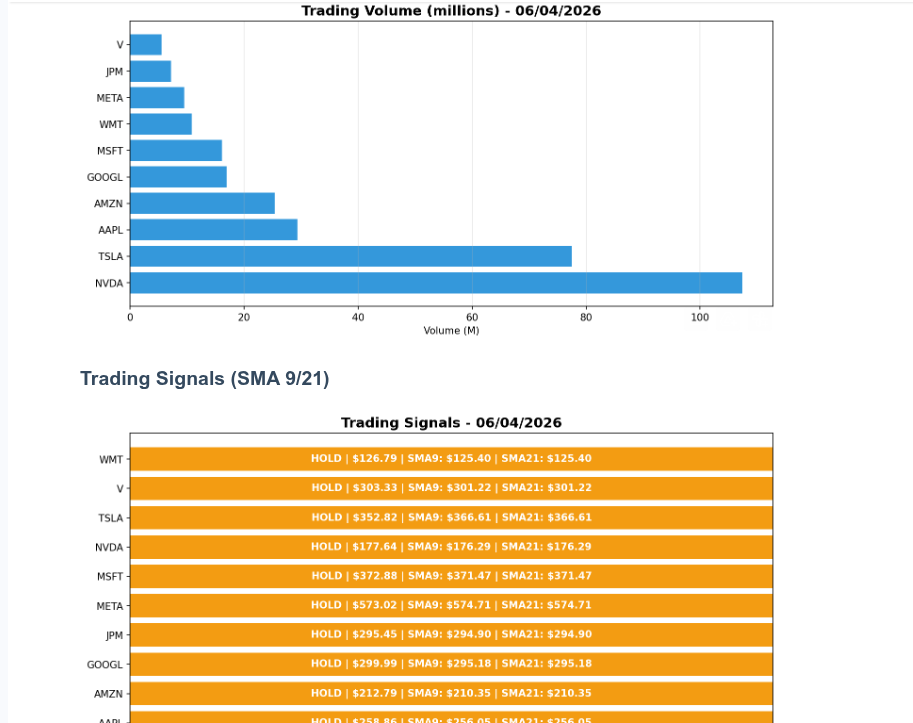

# Stock Market ETL & Analytics Pipeline

End-to-end data pipeline for stock market analysis using **Apache Airflow**. The pipeline ingests market data from Yahoo Finance, processes technical indicators (SMA, EMA, volatility), stores it in a **PostgreSQL data warehouse** modeled as a star schema, and delivers automated daily insights via email reports with charts and alerts.

`Apache Airflow` `Python` `PostgreSQL` `Docker` `pandas` `NumPy` `matplotlib`

---

## Architecture



### Airflow DAG — Analytics Pipeline



## Tech Stack

| Layer              | Technology                          |
|--------------------|-------------------------------------|
| Orchestration      | Apache Airflow 2.8                  |
| Data Ingestion     | yfinance (Yahoo Finance API)        |
| Data Transformation| pandas, NumPy                       |
| Data Warehouse     | PostgreSQL 15 (Star Schema)         |
| Analytics          | pandas, NumPy (technical indicators)|
| Visualization      | matplotlib                          |
| Delivery           | SMTP (Gmail) with embedded charts   |
| Infrastructure     | Docker / Docker Compose             |

## Pipeline Flow

### DAG 1: `stock_market_etl` — runs weekdays at 20:00

```
Data Ingestion → Data Transformation → Load Dimensions → Load Facts → Load Summaries
```

### DAG 2: `stock_market_analytics` — runs weekdays at 20:30

```
┌─ Moving Averages (SMA-9, SMA-21, EMA-9) ─┐
├─ Volatility Analysis (30d, 60d) ──────────┼─► Alert Engine → Chart Generation → Email Delivery
└─ Accumulated Returns (7d, 30d, 90d) ──────┘
```

## Data Model (Star Schema)

```
┌──────────────┐       ┌───────────────────┐       ┌──────────────┐
│  dim_company │──────►│ fact_stock_price   │◄──────│   dim_date   │
│              │       │                   │       │              │
│ ticker       │       │ open/high/low/    │       │ full_date    │
│ name         │       │ close/volume      │       │ year/month   │
│ sector       │       │ daily_return      │       │ day_of_week  │
│ industry     │       │                   │       │ is_weekend   │
└──────────────┘       └───────────────────┘       └──────────────┘
                       ┌───────────────────┐
                       │ fact_daily_summary │
                       │                   │
                       │ avg_return         │
                       │ best/worst ticker  │
                       │ total_volume       │
                       └───────────────────┘

┌────────────────────────┐  ┌────────────────────────┐  ┌────────────────────────┐
│ analytics_moving_avg   │  │ analytics_volatility   │  │ analytics_returns      │
│                        │  │                        │  │                        │
│ SMA-9 / SMA-21 / EMA-9│  │ volatility 30d / 60d   │  │ return 7d / 30d / 90d  │
│ BUY / SELL / HOLD      │  │ volume ratio           │  │                        │
└────────────────────────┘  └────────────────────────┘  └────────────────────────┘

┌────────────────────────┐
│ analytics_alerts       │
│                        │
│ BIG_DROP / BIG_GAIN    │
│ HIGH_VOLUME / SIGNALS  │
│ severity levels        │
└────────────────────────┘
```





## Output Examples

The pipeline delivers automated daily reports via email with real market data:

**Performance Overview & Alerts:**



**Daily Returns — gains (green) vs losses (red):**



**Trading Volume & SMA Signals (BUY/SELL/HOLD):**



### Alert Types

| Alert          | Trigger                      | Severity |
|----------------|------------------------------|----------|
| BIG_DROP       | Daily return < -3%           | WARNING / CRITICAL (< -5%) |
| BIG_GAIN       | Daily return > +3%           | INFO     |
| SIGNAL_BUY     | SMA-9 crosses above SMA-21   | INFO     |
| SIGNAL_SELL    | SMA-9 crosses below SMA-21   | INFO     |
| HIGH_VOLUME    | Volume > 1.5x 30-day average | WARNING  |

## Getting Started

### Prerequisites

- Docker and Docker Compose
- Gmail account with App Password (for email reports)

### Quick Start

```bash
# 1. Clone
git clone https://github.com/willrosa93/stock-market-etl.git
cd stock-market-etl

# 2. Configure email (optional)
cp .env.example .env
# Edit .env with your Gmail App Password

# 3. Start everything
docker-compose up -d

# 4. Initialize Airflow
docker-compose run --rm airflow-init
docker-compose restart airflow-webserver airflow-scheduler
```

**Airflow UI:** http://localhost:8081 (admin / admin)

Enable both DAGs and trigger manually, or wait for the scheduled runs (weekdays at 20:00 and 20:30).

### Query the Data Warehouse

```bash
psql -h localhost -p 5434 -U warehouse -d stock_warehouse
```

```sql
-- Latest prices with trading signals
SELECT c.ticker, c.name, d.full_date,
       p.close_price, p.daily_return,
       ma.sma_9, ma.sma_21, ma.signal
FROM fact_stock_price p
JOIN dim_company c ON c.company_id = p.company_id
JOIN dim_date d ON d.date_id = p.date_id
LEFT JOIN analytics_moving_averages ma
  ON ma.company_id = p.company_id AND ma.date_id = p.date_id
ORDER BY d.full_date DESC, c.ticker
LIMIT 20;

-- Performance ranking (latest day)
SELECT c.ticker, c.name,
       r.return_7d * 100 AS "7d %",
       r.return_30d * 100 AS "30d %",
       v.volatility_30d
FROM analytics_returns r
JOIN dim_company c ON c.company_id = r.company_id
JOIN dim_date d ON d.date_id = r.date_id
LEFT JOIN analytics_volatility v
  ON v.company_id = r.company_id AND v.date_id = r.date_id
WHERE d.full_date = (
  SELECT MAX(full_date) FROM dim_date dd
  JOIN analytics_returns ar ON ar.date_id = dd.date_id
)
ORDER BY r.return_7d DESC;
```

## Stocks Tracked

| Ticker | Company           | Sector                 |
|--------|-------------------|------------------------|
| AAPL   | Apple             | Technology             |
| MSFT   | Microsoft         | Technology             |
| GOOGL  | Alphabet          | Communication Services |
| AMZN   | Amazon            | Consumer Cyclical      |
| NVDA   | NVIDIA            | Technology             |
| META   | Meta Platforms    | Communication Services |
| TSLA   | Tesla             | Consumer Cyclical      |
| JPM    | JPMorgan Chase    | Financial Services     |
| V      | Visa              | Financial Services     |
| WMT    | Walmart           | Consumer Defensive     |

## Project Structure

```
.
├── dags/
│   ├── stock_etl_dag.py            # Data ingestion & loading DAG
│   ├── stock_analytics_dag.py      # Analytics & reporting DAG
│   └── scripts/
│       ├── extract.py              # Data ingestion (Yahoo Finance)
│       ├── transform.py            # Data transformation & cleaning
│       ├── load.py                 # Data warehouse loading (upserts)
│       ├── analytics.py            # Technical indicators & alerts
│       └── report.py               # Chart generation & email delivery
├── sql/
│   ├── create_tables.sql           # Star schema DDL
│   └── create_analytics_tables.sql # Analytics tables DDL
├── docs/                           # Screenshots and documentation
├── docker-compose.yaml
├── Dockerfile
├── requirements.txt
├── .env.example
└── README.md
```

## Features

- **Automated Data Ingestion**: Daily extraction of 10 major US stocks from Yahoo Finance
- **Star Schema Data Warehouse**: Dimensional modeling with fact and dimension tables
- **Technical Indicators**: SMA-9, SMA-21, EMA-9 with BUY/SELL/HOLD signals
- **Volatility Analysis**: 30-day and 60-day volatility with volume anomaly detection
- **Performance Tracking**: 7-day, 30-day, and 90-day accumulated returns
- **Smart Alert Engine**: Automatic detection of big drops (>3%), big gains, abnormal volume
- **Automated Reporting**: HTML email reports with embedded charts via Gmail SMTP
- **Fully Containerized**: Single `docker-compose up` to start the entire pipeline
